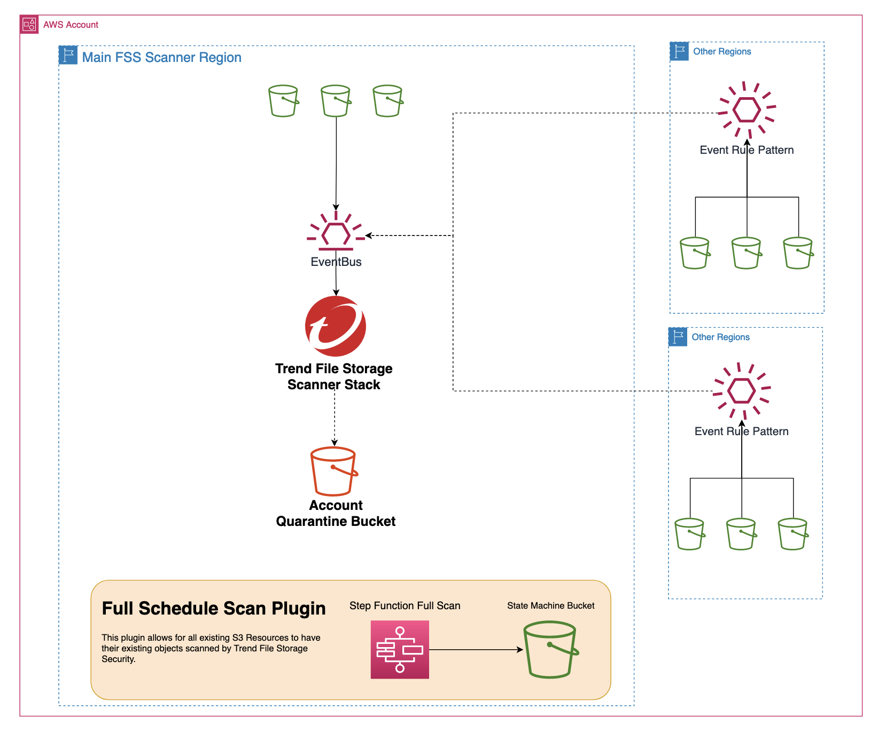

# File Storage Security Account-Wide Deployment

This repo contains templates to deploy Trend Cloud One File Storage Security throughout an AWS Account.

## Deploy File Storage Security throughout AWS Account.

### What is going on?
- The Main Template is deployed to the determined AWS Account.
- The Stack will create an IAM Role and S3 Quarantine bucket for the account and launch a stackset to create the EventBridge Rule Pattern in every alternative AWS Region.
- Next, a stack deploys the File Storage Scanner Stack.
- Third, a stack deploys custom lambda resources to perform the following tasks:
   - Creates a Secret in Secrets Manager for the API Key secure storage.
   - Determines any KMS Key ARN's associated with applicable existing S3 resources in that account.
   - Enables EventBridge Notifications for all existing S3 resources in that account.
   - Registers the File Storage Scanner Stack to Trend Backend for Licensing Updates.
   - Updates Scanner Stack Parameters to include quarantine and KMS Keys.
- Last the Full Schedule Scan Plugin is deployed.

---

## What is needed before you deploy

You will need:
   - AWS Account
   - Valid Cloud One Account
   - You need both **[AWSCloudFormationStackSetAdministrationRole](https://s3.amazonaws.com/cloudformation-stackset-sample-templates-us-east-1/AWSCloudFormationStackSetAdministrationRole.yml)** and **[AWSCloudFormationStackSetExecutionRole](https://s3.amazonaws.com/cloudformation-stackset-sample-templates-us-east-1/AWSCloudFormationStackSetExecutionRole.yml)** 
   - See [Grant self-managed permissions for StackSets](https://docs.aws.amazon.com/AWSCloudFormation/latest/UserGuide/stacksets-prereqs-self-managed.html#stacksets-prereqs-accountsetup)
   - [Full Access Cloud One API Key](https://cloudone.trendmicro.com/docs/identity-and-account-management/c1-api-key/)

---

### Deployment Steps

[FSS Parameters]
- **APIKey**: Value of Cloud One API Key.
- **CloudOneRegion**: The region your Cloud One Tenant resides in.
- **ExternalID**: Cloud One ExternalID value.
- **RegionsToEnable**: Alternative region to where the Scanner was deployed. This will allow for events outside the main scanner region to be routed to the Scanner Stack.

[AWS Parameters]
- **AdminRoleARN**: ARN Value of StackSetAdministrator Role.

[Full Scan Parameters]
- **IncludedBuckets**: Comma separated list of buckets to be included in the scan. If empty, all buckets will be scanned and make sure to exclude any quarantine buckets from the scan to avoid infinite loops. If not empty, 'ExcludeBuckets' will be ignored.
- **ExcludedBuckets**: Comma separated list of buckets to be excluded from the scan. If empty, no buckets will be excluded from the scan.
- **Schedule**: Set a schedule for full scan. If empty, there will not be a scheduled scan. Defaults to empty. More info at: https://docs.aws.amazon.com/lambda/latest/dg/services-cloudwatchevents-expressions.html

--- 
